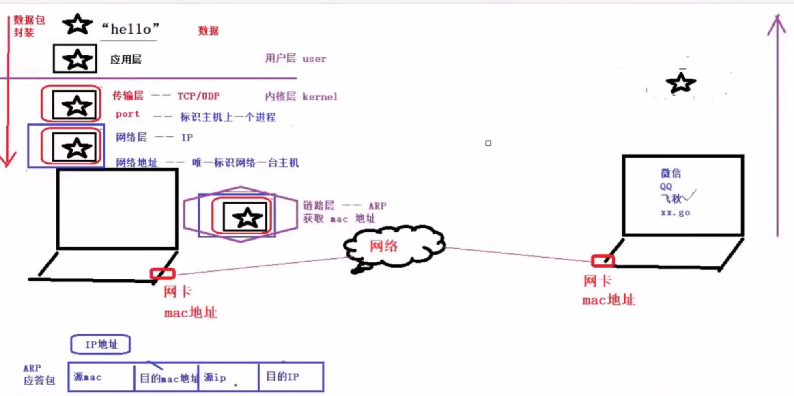

协议：
    从应用的角度出发，协议可以理解为“规则”，是数据传输和数据解释的规则。
典型的协议：
    应用层：HTTP/FTP，传输层：TCP/UDP,网络层：IP/ICMP/IGMP，网络接口层：ARP/RARP

**TCP/IP分层(4)**：应用层、传输层(port)、网络层(Ip)、链路层
**OSI/RM分层(7)**：应用层、表示层、会话层、|传输层(port)、|网络层(Ip)、|数据链路层、物理层

应用层（应用程序之间）、传输层（进程之间）、网络层（主机之间）、链路层（设备之间）

数据通信过程：
    封装：应用层--传输层--网络层--链路层
    解封装：反过来

总结通信过程：

    1.mac地址（不需要用户指定）  ARP协议：IP->mac
    2.IP地址（用户指定）   --确定主机
    3.port端口号（用户指定）  --确定程序
        (1).不适用系统默认端口
        (2).端口5000 - 65535

通信过程示意图：

Socket编程：
    网络通信过程中，socket一定是成对出现的

网络应用程序设计模式
    
    1.C/S模式
        客户机（clent），服务及（server）需要通信两段各自部署客户机和服务器来完成数据通信 
        优点：协议灵活；缺点：工作量大，需要下载
    2.B/S模式
        浏览器（Browser），服务器（server）只需要一段部署服务器，而另一端使用浏览器就可以完成
        优点：开发量小，不受平台限制；缺点：网络应用受限，缓存不尽人意，只能用http，协议不灵活