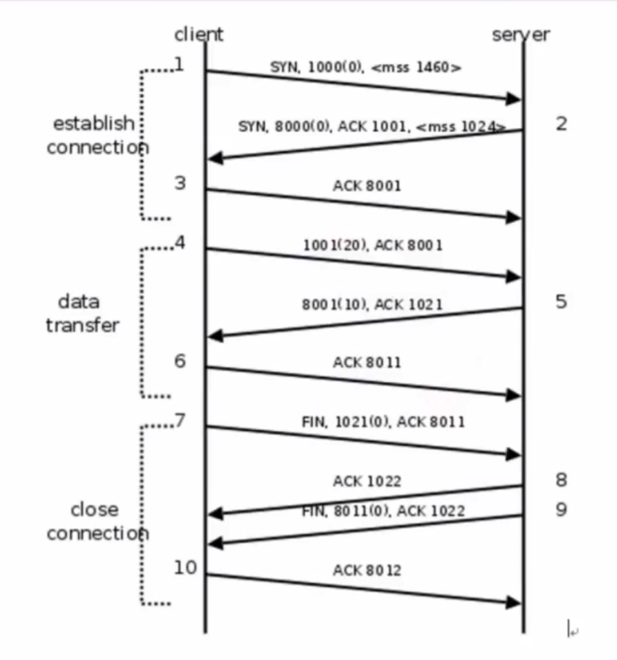
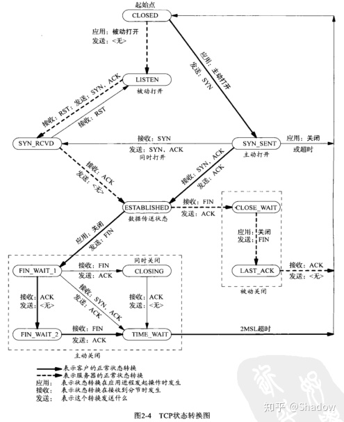
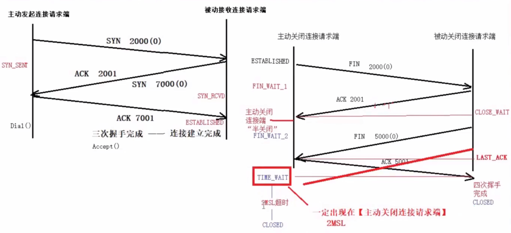

 **三次握手**
 
    **第一次握手**  主动发起连接请求端：————>请求建立连接的愿望 ————> 被动接收连接请求端
    
    -->SYN 1000(0)-->
    
    **第二次握手**  主动发起连接请求端：<————同意过来的请求，同时向对方发起连接请求 <————被动接收连接请求端( 函数Dial() )
    
    <--ACK 1001；SYN 8000(0) <--
    
    **第三次握手**  主动发起连接请求端：————>好的，我也同意  ————>  被动接收连接请求端 ( 函数Accept() )
    
    -->ACK 8001 -->

**传输数据时**

    1.主动发起连接请求端：————>发送一个数据包的同时，再次回应同意 ————> 被动接收连接请求端
    
    -->1001(20); ACK 8001 -->
    
    2.主动发起连接请求端：<———— 应答发送的数据包，同时发送一个数据包 <————被动接收连接请求端
    
    <-- ACK 1021; 8001(10) <--
    
    3.主动发起连接请求端：————> 应答收到 ————>被动接收连接请求端
    
    --> ACK 8011 -->

**四次挥手**

    **第一次挥手** 主动发起关闭端: ————> 关闭请求+上一次数据传输应答 ————>被动接收关闭端
    
    --> FIN 1021(0); ACK 8011 -->
    
    **第二次挥手** 主动发起关闭端：<———— 回应:同意关闭 <———— 被动接受关闭端
    
    <-- ACK 1022 <--
    
    (第二次挥手之后处于半关闭，这时候服务端还是可以发送信息的，客户端还是可以接受信息的)
    
    **第三次挥手** 主动发起关闭端: <———— 关闭请求 + 上一次同意关闭的应答<———— 被动接收关闭端
    
    <-- FIN 8011(0); ACK 1022 <--
    
    **第四次挥手** 主动发起关闭端: ————> 同意关闭应答 ————>被动接收关闭端
    
    -->ACK 8012 -->

为什么建立连接是三次，关闭连接是四次：半关闭

**TCP状态转化**
    
    1.主动发起连接请求端：CLOSED -- 完成三次握手 -- ESTABLISEHED(数据通信状态) --Dial()函数返回
    2.被动发起连接请求端：CLOSED -- 调用Accept() -- LISTEN -- 三次握手 -- ESTABLISEHED(数据通信状态)
        -- Accept()函数返回数据传递期间 -- ESTABLISEHED(数据通信状态)
    3.主动关闭连接请求端：ESTABLISEHED -- FIN_WAIT_2(半关闭) -- TIME_WAIT -- 2MSL --
        确认最后一个ACK被对端成功接收 -- CLOSED
      半关闭、TIMA_WAIT、2MSL --- 只会出现在 “主动关闭连接请求端”  

*** **过程图**  ***

*** **TCP状态转化图**  ***

*** **过程图/TCP状态转化图** *** 

