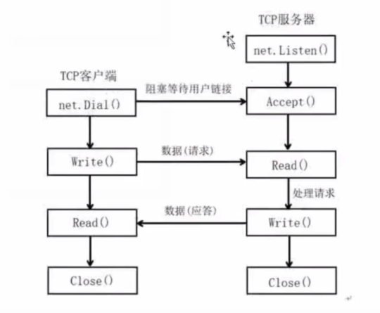
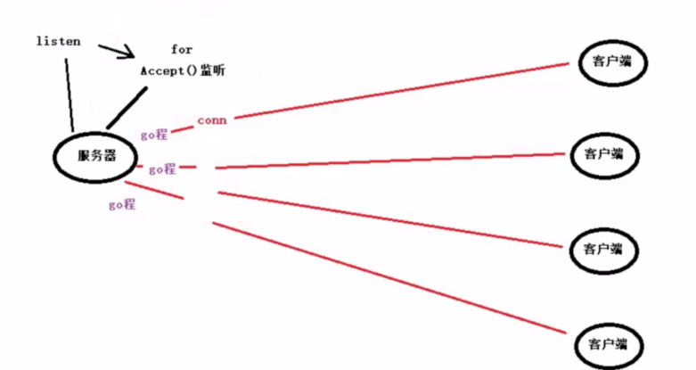

一、**TCP的C/S架构：**

二、**遇到多个client时**
----利用go程来解决

三、TCP-CS并发服务器：

    1.创建监听套接字listener := net.Listen("tcp",ip+port)
    2.defer listener.Close()
    3.for 循环 监听客户端连接事件  conn:=listener.Accept()
    4.创建go程，对应每一个客户端进行数据通信  go HandlerConnect()
    5.实现HandlerConnect(conn net.Conn)